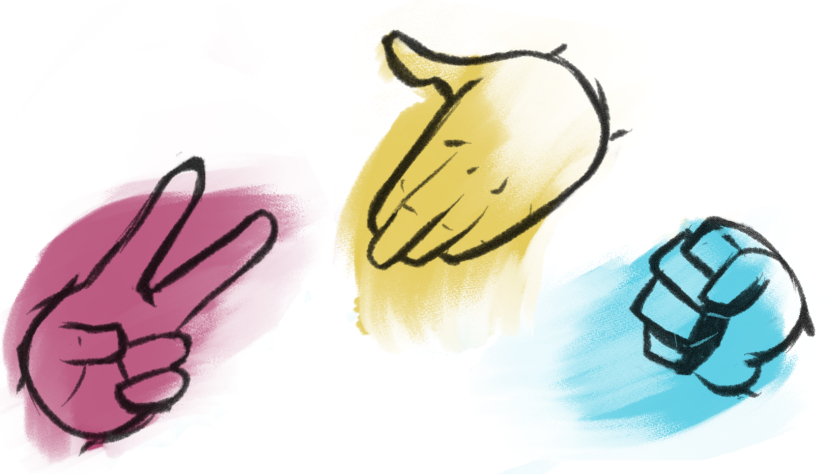

# rock-paper-scissors

## Description
This in-browser app allows a single user to play a game of Rock, Paper, Scissors with a computer oponent. 
It has the following features:
- Pop-ups with reactive messages based on user-input
- Looping gameplay. Test your luck as many times as you want!
- A scorecard to keep track of who's champ and who's chump.

## Installation
N/A

## Usage

See the published site: [here](https://stevengoldbergm.github.io/rock-paper-scissors/)
- To use the webpage, simply follow the prompts on the screen
- If you decide to stop playing, or you don't follow the on-screen instructions, the game will stop 
- To restart the game, simply refresh your browser window

## License
N/A

